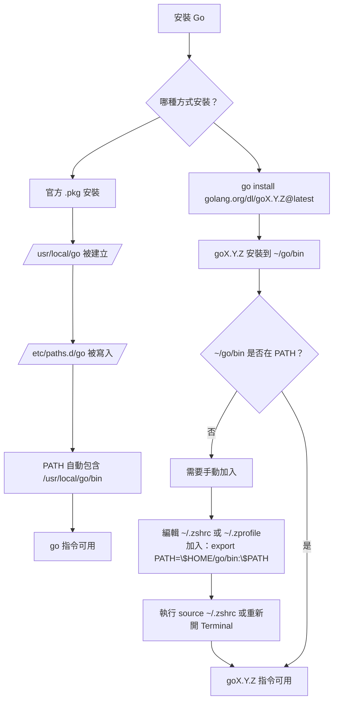

## 安裝方法

https://go.dev/doc/install

### Mac 環境

官方 `.pkg` 安裝檔會將 Go 安裝到

```bash
/usr/local/go
```

並且會**自動**將這個資料夾中的執行檔路徑加入到`$PATH`環境變數中

```bash
/usr/local/go/bin
```

安裝完成後輸入下面指令

```bash
which go
go version
```

就會出現

```
/usr/local/go/bin/go
go version gox.y.z darwin/arm64
```

#### `.pkg` 安裝檔設定PATH的方法

.pkg 安裝程式會建立一個檔案

```bash
/etc/paths.d/go
```

檔案內容為

```bash
/usr/local/go/bin
```

Terminal啟動時

會自動讀取 /etc/paths 和 /etc/paths.d/* 的內容

將路徑自動加到 PATH 最前面

## 安裝多個 Go 版本

https://go.dev/doc/manage-install

```bash
go install golang.org/dl/go1.16.15@latest
```

安裝後會將 CLI 工具存到路徑`~/go/bin/go1.16.15`

但**不會自動**設定PATH

所以設定PATH之後

```bash
echo 'export PATH="$HOME/go/bin:$PATH"' >> ~/.zprofile
```

再安裝即可

```bash
go1.16.15 download
```

安裝後會有兩個東西：

| 類型 | 路徑 | 說明 |
|------|------|------|
| CLI 工具 | `~/go/bin/go1.16.15` | 專屬的指令入口，用來呼叫此版本 |
| SDK | `~/sdk/go1.16.15` | 實際執行與編譯的 Go 核心 |

接著輸入下面指令

```bash
which go1.16.15
go1.16.15 version
```

就會出現

```
~/go/bin/go1.16.15
go version go1.16.15 darwin/arm64
```

## 安裝方法整理


